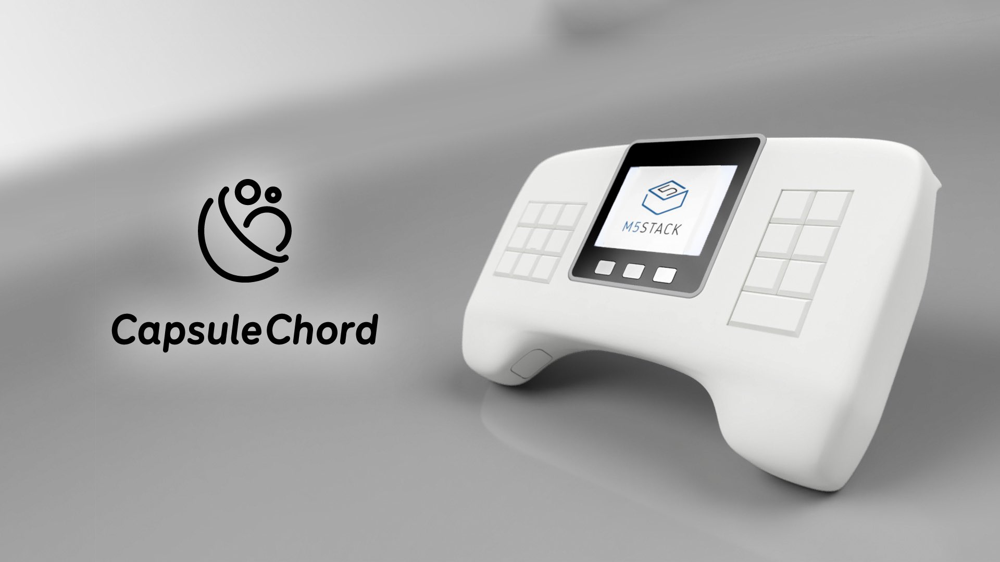

# CapsuleChord
An electronic instrument for playing chords, using the M5Stack

The firmware in M5Stack is based on [M5Stack_BLEChorder](https://github.com/wararyo/m5chorder).
BLEChorder can be played alone on the M5Stack.

[🎥Introduction Video](https://youtu.be/JE3piJ5rN3A)

Currently this project is in progress.  
The latest information -> [#CapsuleChord](https://twitter.com/search?q=%23CapsuleChord&f=live) (Japanese)

**2020/09/26 3D model files are now available!**  
See `Case` directory.

## Features

* Easy to play chords
* Specify a diatonic code with the left keypad and modify it with the right keypad
* Can be connected with iOS/iPadOS/macOS/Windows via BLE (On Windows, requires MIDIberry and loopMIDI)

## Structure

* M5Stack Gray
* Keypad Controller(ATmega328P)
* Two keypads
* Two function buttons
* Two up-down sliders

## Required to make

### M5Stack

* M5Stack Gray
* M5Stack battery module
* M5Stack proto module

### Keypads

* ATmega328P
* 23 tactile switches
* 8 diodes

### Other

* Two 3pin connectors and sockets
* Two 8pin connectors and sockets
* Six 2M tapping screws (to mount keypads)
* Four 3M tapping scress (to close the casing)
* Two 3M tapping scress (to mount the M5Stack)
* AVRISP of some kind
* and a 3D printing environment :)

## Credits

* [M5TreeView](https://github.com/lovyan03/M5Stack_TreeView) by [lovyan03](https://github.com/lovyan03)
* [M5Stack 3DModel](https://botalab.tech/m5stack_cad_data/) by [botamochi6277](https://botalab.tech/)
